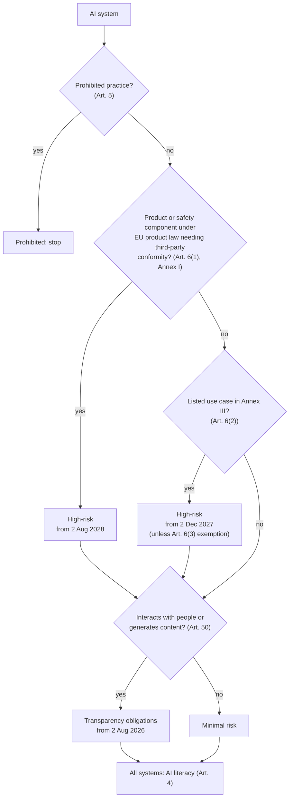
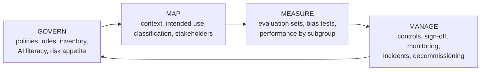
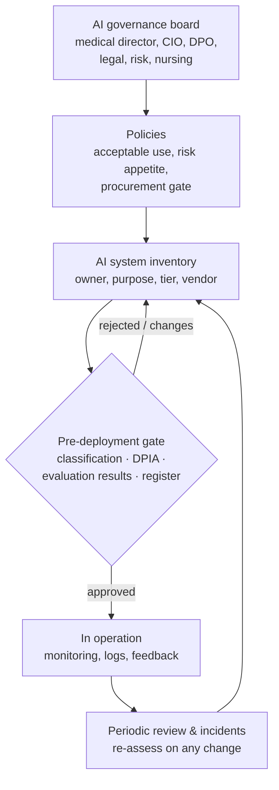

# AI Governance Assessment: EU AI Act and NIST AI RMF

> An assessment of two AI systems at a **fictional EU public hospital group**: what the **EU AI Act** requires for each, how the **NIST AI Risk Management Framework** organises the work, a scored **risk register**, and the governance set-up that keeps it current. Not legal advice. Dates reflect the AI Act as amended by the **AI Omnibus, Regulation (EU) 2026/1744**, in force since 27 July 2026.

## 1. Systems assessed

| | System A: staff policy assistant | System B: emergency triage assistant (counter-example) |
|---|---|---|
| Purpose | Answers staff questions about *administrative* policies (leave, procurement, IT use), with citations | Suggests an urgency level for patients arriving at the emergency department, for nurse review |
| Technology | RAG over internal policy documents + a general-purpose AI model from a vendor (the pattern in project 5 of this portfolio) | Clinical prediction model |
| Data | Policy documents; no patient data | Patient vital signs and symptoms |
| Organisation's role | **Provider** (builds and puts it into service under its own name) **and deployer** | Provider and deployer |

System B is included on purpose: it shows how a similar-sounding "AI assistant" falls into a completely different regulatory tier once it influences clinical decisions.

## 2. EU AI Act classification

**Results** (generated by `python -m governance classify`):

| | System A | System B |
|---|---|---|
| Tier | **Transparency (Art. 50)** | **High-risk**, by two routes: medical-device software under the EU MDR (Annex I) **and** Annex III point 5(d), emergency healthcare patient triage |
| Key obligations | Tell users they're talking to an AI (Art. 50(1)); machine-readable marking of generated content, scope to confirm for an internal text tool (Art. 50(2)); AI literacy (Art. 4) | Risk management, data governance, technical documentation, logging, instructions for use, human oversight, accuracy/robustness/cybersecurity, quality management, conformity assessment, post-market monitoring (Art. 9–17, 43, 72–73); deployer duties (Art. 26) and a fundamental rights impact assessment as a public body (Art. 27) |
| Applies from | 2 Aug 2026 (Art. 50); Art. 4 already applies | **2 Dec 2027** (the earlier of the two routes) |
| Model vendor | General-purpose AI model obligations (Art. 53–55) sit with the model provider: do due diligence and keep their documentation | n/a |

**Scope note:** the AI Act applies to systems placed on the EU market or whose output is used in the EU. A hospital outside the EU (in Lebanon, for example) isn't directly bound, but the same assessment works well as a voluntary benchmark and is increasingly expected by international partners and funders.

## 3. NIST AI RMF mapping

The NIST AI RMF 1.0 organises AI risk work into four functions. The generative-AI risks below come from NIST's *Generative AI Profile* (NIST AI 600-1).

| Function | What it means here | Register items |
|---|---|---|
| **GOVERN** | AI inventory, acceptable-use policy, AI literacy, logging standards, roles | R02, R08, R12 |
| **MAP** | Intended use, legal classification (§2), clinical context, who can be harmed | R09 |
| **MEASURE** | Evaluation sets, subgroup performance, regression tests before model changes | R01, R06, R07, R10 |
| **MANAGE** | Controls in operation, privacy, security, oversight design, sign-off | R03, R04, R05, R11 |

## 4. Risk register summary

Full register: [`assessment/risk_register.csv`](assessment/risk_register.csv). It's validated and scored by `python -m governance register`, and CI fails if it's malformed or if any residual risk reaches the "block" level.

**Risk appetite** (illustrative): residual score (likelihood × impact, 1–25) of 1–8 is accepted by the owner, 9–14 needs AI governance board sign-off, and 15+ means the system can't go live.

| ID | System | Risk | Inherent | Residual | Decision |
|---|---|---|---:|---:|---|
| R09 | B | Triage under-estimates urgency, patient harmed | 15 | 10 | Board sign-off |
| R10 | B | Lower accuracy for some patient groups | 15 | 8 | Accepted |
| R11 | B | Automation bias: suggestions accepted without independent assessment | 16 | 8 | Accepted |
| R01 | A | Made-up policy answer followed by staff | 12 | 6 | Accepted |
| R03 | A | Personal data in prompts reaches the vendor | 12 | 6 | Accepted |
| R12 | Org | AI tools used without inventory (shadow AI) | 12 | 4 | Accepted |
| … | | 6 further risks | | ≤ 4 | Accepted |

**Reading it:** System A's risks are manageable with standard controls. System B stays above the owner's appetite even with strong controls (R09), so it would need board sign-off, an MDR conformity assessment and a clinical validation study before any use. That's a project in its own right, not a quick add-on.

## 5. Governance operating model

## 6. Decisions (ADRs)

### ADR-001: The EU AI Act as the legal baseline, NIST AI RMF as the working method
- **Why:** The AI Act says *what* is required. The NIST AI RMF gives a practical, widely recognised structure for *how* to do the work. ISO/IEC 42001 (AI management systems) is the natural next step if certification is wanted.

### ADR-002: Classify per use case, not per model
- **Why:** The same underlying model can be minimal risk in one use (policy Q&A) and high-risk in another (triage). Obligations follow the *intended purpose*. System A versus System B shows this.

### ADR-003: Encode classification and the register as code, checked in CI
- **Why:** The register stays consistent: every risk has an owner, scores are valid, residual never exceeds inherent, and go-live blockers are visible automatically. Legal judgement stays with people, but the bookkeeping doesn't drift.

### ADR-004: Human oversight designed in, not bolted on
- **Decision:** For System B, the nurse makes an independent assessment first, sees the model's reasons and confidence, and override rates are audited.
- **Why:** Art. 14 requires effective oversight, and automation bias (R11) is the main way oversight fails in practice.

### ADR-005: Vendor due diligence for general-purpose models
- **Decision:** Before using a vendor model: review their documentation and usage policies, agree data processing terms, pin the model version, and re-run the evaluation set before any upgrade.
- **Why:** The vendor carries the GPAI model obligations, but the hospital remains responsible for its own system.

## 7. Risks of the governance programme itself

| Risk | Mitigation |
|---|---|
| Paper compliance: documents exist, but controls don't run | Evidence-based gate (evaluation results, logs) and periodic sampling |
| Regulation keeps changing (e.g. the 2026 Omnibus) | Dated legal baseline in this document; reviewed at least every 6 months |
| Governance seen as a blocker, so staff use shadow AI | Fast track for minimal-risk tools; clear acceptable-use policy (R12) |
| The simplified classifier is misread as legal advice | Stated in code and docs; legal sign-off required for every high-risk result |

## 8. Cost (effort)

Rough planning ranges for a mid-sized organisation (estimates, not benchmarks):

| Activity | Effort |
|---|---|
| Set up governance (board, policies, inventory, risk appetite) | ~20–40 person-days |
| Assessment of a transparency-tier system like A (classification, DPIA, register, evaluation set) | ~5–10 person-days |
| High-risk system like B (QMS, technical documentation, clinical validation, conformity assessment with a notified body) | Months of multidisciplinary work plus external fees. Budget it as a project |
| Ongoing operation (reviews, monitoring, training) | A part-time AI governance lead plus owners' time |

## 9. Sources

- Regulation (EU) 2024/1689 (Artificial Intelligence Act), as amended by Regulation (EU) 2026/1744 (AI Omnibus): new dates of 2 Dec 2027 (Annex III) and 2 Aug 2028 (Annex I); Art. 50 transparency kept at 2 Aug 2026.
- NIST AI Risk Management Framework 1.0 (NIST AI 100-1, January 2023) and the Generative AI Profile (NIST AI 600-1, July 2024).
- Summaries of the Omnibus used for the dates: [Cloud Security Alliance research note](https://labs.cloudsecurityalliance.org/research/csa-research-note-eu-ai-act-high-risk-deadline-omnibus-20260/), [Gibson Dunn](https://www.gibsondunn.com/eu-ai-act-omnibus-agreement-postponed-high-risk-deadlines-and-other-key-changes/).
